## Executive Overview

PrometheOS Lite is a Rust-based, local-first AI agent orchestration CLI centered on a new flow runtime. Its current architecture exposes both a modern `flow` system and deprecated legacy `agents` / `core` modules, because apparently even clean rewrites need a haunted basement. The README describes the project as a “Flow-centric AI agent orchestration system” with flow execution, nested flows, parallel flows, self-reflection loops, batch processing, debugging, policy hooks, sandboxed tools, rate limiting, model routing, and SQLite-backed memory in `README.md` .

Primary capabilities:

* CLI execution through `src/main.rs` and `src/cli/mod.rs`.
* Flow execution via `src/flow/flow.rs`.
* Explicit shared state via `src/flow/types.rs`.
* Node lifecycle abstraction via `src/flow/node.rs`.
* Advanced flow types via `src/flow/flow_types.rs`.
* Model routing and tool execution via `src/flow/intelligence.rs`.
* SQLite memory and semantic search via `src/flow/memory.rs`.
* Checkpointing and orchestration via `src/flow/orchestration.rs`.
* Legacy Planner → Coder → Reviewer migration through `src/flow/adapter.rs` and `src/flow/migration.rs`.

Key tech-stack choices:

* **Rust 2024** for safety, local performance, and predictable CLI behavior, declared in `Cargo.toml` .
* **Tokio** for async execution across CLI, LLM calls, flow nodes, and tool processes.
* **Reqwest** for OpenAI-compatible local LLM HTTP APIs.
* **Rusqlite bundled** for local memory persistence.
* **Serde / serde_json** for flow files, shared state, memory metadata, and dynamic node I/O.
* **Clap** for CLI command parsing.
* **Async-trait** because Rust async traits remain a tiny ceremony altar humans must bow before.

## Repository Structure & Module Map

| Name & path                                 | Purpose                                                                                                                                                         | Tag         |
| ------------------------------------------- | --------------------------------------------------------------------------------------------------------------------------------------------------------------- | ----------- |
| `Cargo.toml`                                | Defines Rust package metadata and dependencies including tokio, clap, reqwest, rusqlite, serde, regex, uuid, chrono.                                            | `@core`     |
| `src/main.rs`                               | Async binary entrypoint that delegates execution to `cli::run()`.                                                                                               | `@utility`  |
| `src/lib.rs`                                | Public module root exposing agents, config, core, flow, fs, llm, logger.                                                                                        | `@core`     |
| `src/cli`                                   | CLI command parsing and flow runner integration.                                                                                                                | `@utility`  |
| `src/flow`                                  | Flow-centric runtime containing Node, Flow, SharedState, orchestration, memory, intelligence, debugging, tracing, policy, rate limiting, runtime, and migration support. | `@core`     |
| `src/agents`                                | Deprecated legacy Planner/Coder/Reviewer agent abstraction.                                                                                                     | `@domain`   |
| `src/core`                                  | Deprecated sequential orchestrator and execution context.                                                                                                       | `@domain`   |
| `src/llm`                                   | Local-first LM Studio/OpenAI-compatible HTTP client.                                                                                                            | `@core`     |
| `src/fs`                                    | Parses generated markdown code blocks into files and writes them to `prometheos-output`.                                                                        | `@utility`  |
| `src/logger`                                | Structured CLI logging and streaming output support.                                                                                                            | `@utility`  |
| `src/config`                                | Loads `prometheos.config.json` and environment overrides.                                                                                                       | `@core`     |
| `docs`                                      | Product, architecture, operations, and guide documentation referenced by README.                                                                                | `@utility`  |
| `prometheos.config.json`                    | Expected runtime config file for provider, base URL, model, embedding URL, and embedding dimension.                                                             | `@core`     |
| External: LM Studio / OpenAI-compatible API | LLM backend accessed over HTTP.                                                                                                                                 | `@external` |
| External: SQLite                            | Local persistence backend through rusqlite.                                                                                                                     | `@external` |

## Inter-Module Dependency Graph

```mermaid
graph TD
    Main["src/main.rs @utility"] --> CLI["src/cli @utility"]
    CLI --> Config["src/config @core"]
    CLI --> LLM["src/llm @core"]
    CLI --> FS["src/fs @utility"]
    CLI --> Logger["src/logger @utility"]
    CLI --> Flow["src/flow @core"]
    CLI --> LegacyCore["src/core @domain"]

    Lib["src/lib.rs @core"] --> Agents["src/agents @domain"]
    Lib --> Config
    Lib --> LegacyCore
    Lib --> Flow
    Lib --> FS
    Lib --> LLM
    Lib --> Logger

    Flow --> FlowTypes["src/flow/types.rs @core"]
    Flow --> Node["src/flow/node.rs @core"]
    Flow --> FlowEngine["src/flow/flow.rs @core"]
    Flow --> AdvancedFlow["src/flow/flow_types.rs @core"]
    Flow --> Intelligence["src/flow/intelligence.rs @core"]
    Flow --> Memory["src/flow/memory.rs @core"]
    Flow --> Orchestration["src/flow/orchestration.rs @core"]
    Flow --> Debug["src/flow/debug.rs @utility"]
    Flow --> Tracing["src/flow/tracing.rs @core"]
    Flow --> Policy["src/flow/policy.rs @core"]
    Flow --> RateLimit["src/flow/rate_limit.rs @core"]
    Flow --> Adapter["src/flow/adapter.rs @domain"]
    Flow --> Migration["src/flow/migration.rs @domain"]

    Adapter --> Agents
    Migration --> Agents
    Migration --> LLM
    LegacyCore --> Agents
    LegacyCore --> LLM
    LegacyCore --> Logger

    Intelligence --> Reqwest["reqwest HTTP @external"]
    Intelligence --> TokioProcess["tokio::process @external"]
    Memory --> SQLite["SQLite/rusqlite @external"]
    Memory --> EmbeddingHTTP["Embedding HTTP API @external"]
    LLM --> LMStudio["LM Studio/OpenAI-compatible API @external"]
    Config --> JSON["prometheos.config.json @external"]
```



```dot
digraph PrometheOSLite {
  rankdir=LR;
  node [shape=box];

  Main [label="src/main.rs @utility"];
  CLI [label="src/cli @utility"];
  Lib [label="src/lib.rs @core"];
  Flow [label="src/flow @core"];
  Config [label="src/config @core"];
  LLM [label="src/llm @core"];
  FS [label="src/fs @utility"];
  Logger [label="src/logger @utility"];
  Agents [label="src/agents @domain"];
  LegacyCore [label="src/core @domain"];

  FlowTypes [label="src/flow/types.rs @core"];
  Node [label="src/flow/node.rs @core"];
  FlowEngine [label="src/flow/flow.rs @core"];
  AdvancedFlow [label="src/flow/flow_types.rs @core"];
  Intelligence [label="src/flow/intelligence.rs @core"];
  Memory [label="src/flow/memory.rs @core"];
  Orchestration [label="src/flow/orchestration.rs @core"];
  Debug [label="src/flow/debug.rs @utility"];
  Tracing [label="src/flow/tracing.rs @core"];
  Policy [label="src/flow/policy.rs @core"];
  RateLimit [label="src/flow/rate_limit.rs @core"];
  Adapter [label="src/flow/adapter.rs @domain"];
  Migration [label="src/flow/migration.rs @domain"];

  subgraph cluster_external {
    label="@external systems";
    style=dashed;
    Reqwest [label="reqwest HTTP @external"];
    TokioProcess [label="tokio::process @external"];
    SQLite [label="SQLite/rusqlite @external"];
    EmbeddingHTTP [label="Embedding HTTP API @external"];
    LMStudio [label="LM Studio/OpenAI-compatible API @external"];
    JSON [label="prometheos.config.json @external"];
  }

  Main -> CLI;
  Lib -> Agents;
  Lib -> Config;
  Lib -> LegacyCore;
  Lib -> Flow;
  Lib -> FS;
  Lib -> LLM;
  Lib -> Logger;

  CLI -> Config;
  CLI -> LLM;
  CLI -> FS;
  CLI -> Logger;
  CLI -> Flow;
  CLI -> LegacyCore;

  Flow -> FlowTypes;
  Flow -> Node;
  Flow -> FlowEngine;
  Flow -> AdvancedFlow;
  Flow -> Intelligence;
  Flow -> Memory;
  Flow -> Orchestration;
  Flow -> Debug;
  Flow -> Tracing;
  Flow -> Policy;
  Flow -> RateLimit;
  Flow -> Adapter;
  Flow -> Migration;

  Adapter -> Agents;
  Migration -> Agents;
  Migration -> LLM;
  LegacyCore -> Agents;
  LegacyCore -> LLM;
  LegacyCore -> Logger;

  Intelligence -> Reqwest;
  Intelligence -> TokioProcess;
  Memory -> SQLite;
  Memory -> EmbeddingHTTP;
  LLM -> LMStudio;
  Config -> JSON;
}
```

## Component Deep-Dive

### `src/flow` - Flow Runtime Core

Principal types and functions:

* `SharedState` in `src/flow/types.rs`

  * `input`, `context`, `working`, `output`, `meta`
  * `get_input`, `set_input`, `get_context`, `set_context`, `get_working`, `set_working`, `get_output`, `set_output`, `get_meta`, `set_meta`, `merge`, `get_all_outputs` 
* `Node` trait in `src/flow/node.rs`

  * `id`
  * `prep`
  * `exec`
  * `post`
  * `config` 
* `Flow` and `FlowBuilder` in `src/flow/flow.rs`

  * `run`
  * `execute_with_retry`
  * `validate`
  * `builder`
  * `linear`
  * `build`
* `FlowNode`

  * wraps a flow as a node for nested flow execution
* `RuntimeContext` in `src/flow/runtime.rs`

  * Centralized service registry for ModelRouter, ToolRuntime, MemoryService
  * Builder methods: `with_model_router`, `with_tool_runtime`, `with_memory_service`, `full` 

Interaction paths:

* `src/cli/runner.rs` loads JSON flow files and builds `Flow` instances.
* `src/flow/migration.rs` creates a sequential agent flow using legacy agents.
* `src/flow/adapter.rs` wraps legacy `Agent` implementations as `Node`.
* `src/flow/orchestration.rs` schedules flow runs through `Maestro`.

Patterns:

* Node lifecycle: `prep → exec → post`.
* Action-routed graph traversal.
* Flow-as-node composition.
* Retry with exponential backoff.
* Explicit state buckets instead of one giant untyped blob, mercifully.

### `src/flow/flow_types.rs` - Advanced Flow Types

Principal types:

* `ConditionalNode`
* `LoopNode`
* `BatchFlow`
* `ParallelNode`
* `ReflectionNode` 

Interaction paths:

* Depends on `Flow`, `Node`, `SharedState`, and `NodeConfig`.
* `ParallelNode` runs multiple cloned flows concurrently with a concurrency limit.
* `BatchFlow` replays a base flow for each input item.

Patterns:

* Conditional routing based on state.
* Loop counters stored in `meta`.
* Parallel execution through `futures::join_all`.
* Reflection loop control through caller-provided predicate functions.

### `src/flow/intelligence.rs` - Model Router and Tool Runtime

Principal types:

* `LlmProvider`
* `OpenAiProvider`
* `ModelRouter`
* `ToolSandboxProfile`
* `ToolRuntime`
* `Tool`
* `LlmUtilities` 

Public functions / methods:

* `ModelRouter::generate`
* `ModelRouter::generate_stream`
* `ModelRouter::with_fallback_chain`
* `ToolSandboxProfile::is_command_allowed`
* `ToolSandboxProfile::is_network_allowed`
* `ToolSandboxProfile::is_file_read_allowed`
* `ToolRuntime::execute_command`
* `ToolRuntime::execute_tool`
* `LlmUtilities::call_with_retry`
* `LlmUtilities::call_stream_with_retry`

Interaction paths:

* Uses `reqwest::Client` for provider calls.
* Uses `tokio::process::Command` for process-level tool execution.
* `OpenAiProvider` wraps `LlmClient` to bridge legacy and flow architectures.
* Provides the abstraction layer that should eventually replace direct `src/llm` use.

Patterns:

* Provider fallback chain.
* Tool sandbox profile with allow/block rules.
* Process-level execution with timeout and output limits.
* Streaming callback abstraction.
* LlmProvider trait for pluggable model backends.

Notable hotspot: process isolation exists as child process execution plus command policy, but not true container, chroot, WASM, or OS-level resource isolation. The name is a little more muscular than the implementation, naturally.

### `src/flow/memory.rs` - Local Memory and Semantic Retrieval

Principal types:

* `Memory`
* `MemoryType`
* `MemoryRelationship`
* `MemoryDb`
* `EmbeddingProvider`
* `LocalEmbeddingProvider`
* `ExternalEmbeddingProvider`
* `FallbackEmbeddingProvider`
* `MemoryService`
* `ContextLoaderNode`
* `MemoryWriteNode` 

Public functions / methods:

* `MemoryDb::new`
* `MemoryDb::in_memory`
* `MemoryDb::create_memory`
* `MemoryDb::get_memory`
* `MemoryDb::get_memories_by_type`
* `MemoryDb::create_relationship`
* `MemoryDb::get_relationships`
* `MemoryDb::search_memories`
* `MemoryService::create_memory`
* `MemoryService::semantic_search`
* `MemoryService::log_episode`

Interaction paths:

* Uses `rusqlite::Connection` behind `Arc<Mutex<Connection>>`.
* Calls embedding providers over HTTP through `reqwest`.
* Flow integration occurs through `ContextLoaderNode` and `MemoryWriteNode`.

Patterns:

* Local-first SQLite persistence.
* Embeddings stored as raw BLOB `Vec<f32>` bytes.
* Semantic search implemented manually with cosine similarity over loaded semantic memories.
* Relationship edges stored in a `relationships` table.

Hotspot: despite README-level language around semantic retrieval, the current implementation does not use `sqlite-vec`; it stores embeddings as BLOBs and performs brute-force similarity in Rust. Fine for tiny local state, not heroic at scale. Tiny dragons first.

### `src/flow/orchestration.rs` - Maestro and Continuation Engine

Principal types:

* `RunStatus`
* `FlowRun`
* `RunRegistry`
* `Maestro`
* `ContinuationEngine` 

Public functions / methods:

* `FlowRun::mark_running`
* `FlowRun::mark_completed`
* `FlowRun::mark_failed`
* `FlowRun::mark_paused`
* `RunRegistry::register`
* `RunRegistry::list_active`
* `Maestro::schedule_flow`
* `ContinuationEngine::save_checkpoint`
* `ContinuationEngine::load_checkpoint`
* `ContinuationEngine::list_checkpoints`

Interaction paths:

* `Maestro` executes a `Flow` and updates in-memory run status.
* `ContinuationEngine` persists `SharedState` snapshots as JSON files in a checkpoint directory.

Patterns:

* Simple in-memory run registry.
* JSON checkpoint persistence.
* Flow lifecycle status tracking.

### `src/flow/debug.rs` - Debug Execution

Principal types:

* `StateSnapshot`
* `Breakpoint`
* `DebugSession`
* `StepMode`
* `DebugResult`
* `DebugFlow` 

Interaction paths:

* Wraps `Flow`.
* Uses `Flow::get_node` and `Flow::get_next_node`.
* Captures state snapshots around node execution.

Patterns:

* Breakpoint map keyed by `NodeId`.
* Step modes: run, step over, step into, step out, pause.
* Snapshot serialization for inspection.

Hotspot: `run_debug` executes node methods directly and does not reuse `Flow::execute_with_retry`, so debug behavior may diverge from production flow execution.

### `src/flow/tracing.rs` - Logging and Timeline

Principal types:

* `EventType`
* `LogLevel`
* `LogEntry`
* `TimelineEvent`
* `Tracer`
* `SharedTracer` 

Public utilities:

* `create_tracer`
* `create_tracer_with_level`
* `trace_log!`
* `trace_event!`

Interaction paths:

* Designed as shared instrumentation for flow/node execution, though not deeply wired into `Flow::run` yet.

Patterns:

* Structured logs.
* Timeline event recording.
* JSON export.

### `src/flow/policy.rs` - Policy Hooks

Principal types:

* `PolicyViolation`
* `PolicySeverity`
* `PolicyRule`
* `ConstitutionPolicy`
* `PolicyNode`
* `InputSizeLimitRule`
* `ContentFilterRule`
* `StateMutationRule` 

Interaction paths:

* `PolicyNode` wraps any `Node`.
* Runs pre-validation during `prep`.
* Runs post-validation before delegating to inner `post`.

Patterns:

* Decorator/wrapper node.
* Pluggable rule list.
* Severity-bearing violations.

### `src/flow/rate_limit.rs` - Rate Limiting

Principal types:

* `RateLimitConfig`
* `TokenUsage`
* `RequestRecord`
* `RateLimiter`
* `TokenStats`
* `RequestStats`
* `RateLimitedNode` 

Interaction paths:

* `RateLimitedNode` wraps any `Node`.
* Checks request and token limits during `prep`.
* Checks execution time during `exec`.
* Stops execution timer during `post`.

Patterns:

* Node decorator for guardrails.
* Sliding-ish in-memory time-window cleanup.
* Token/request budget tracking.

### `src/agents` - Deprecated Agent System

Principal types:

* `Agent`
* `AgentRole`
* `PlannerAgent`
* `CoderAgent`
* `ReviewerAgent` 

Interaction paths:

* Used by deprecated `src/core`.
* Wrapped by `AgentNode` in `src/flow/adapter.rs`.
* Used by `src/flow/migration.rs` to recreate Planner → Coder → Reviewer as a Flow.

Patterns:

* Legacy async agent trait.
* Clear deprecation path toward `Node`.

### `src/core` - Deprecated Sequential Orchestration

Principal types:

* `ExecutionContext`
* `ExecutionResult`
* `SequentialOrchestrator` 

Interaction paths:

* Uses `PlannerAgent`, `CoderAgent`, `ReviewerAgent`.
* Uses `LlmClient`.
* Uses `Logger`.
* Still invoked by deprecated CLI `run` command in `src/cli/mod.rs`.

Patterns:

* Linear task pipeline.
* Context object passed between phases.
* Deprecated but still functional.

### `src/llm` - Local LLM Client

Principal types:

* `LlmClient`
* `ChatCompletionRequest`
* `ChatCompletionResponse` 

Public functions:

* `LlmClient::new`
* `LlmClient::from_config`
* `LlmClient::with_retries`
* `LlmClient::generate`
* `LlmClient::generate_stream`
* `generate`

Interaction paths:

* Reads `AppConfig`.
* Calls `/v1/chat/completions`.
* Used by legacy agents and migration flow.

Patterns:

* LM Studio/OpenAI-compatible HTTP interface.
* Retry with exponential backoff.
* Basic streaming response parsing from SSE-like lines.

### `src/config` - Runtime Config

Principal types:

* `AppConfig`
* `DEFAULT_CONFIG_PATH`

Public functions:

* `AppConfig::load`
* `AppConfig::load_from`

Interaction paths:

* Consumed by CLI and `LlmClient`.
* Reads `prometheos.config.json`.
* Supports `PROMETHEOS_BASE_URL` and `PROMETHEOS_MODEL` overrides.
* Now includes `embedding_url` and `embedding_dimension` for memory service configuration.

### `src/fs` - File Parser / Writer

Principal types:

* `ParsedFile`
* `FileParser`
* `FileWriter` 

Public functions:

* `FileParser::parse_files`
* `FileParser::extract_file_blocks`
* `FileWriter::new`
* `FileWriter::with_directory`
* `FileWriter::write_file`
* `FileWriter::write_files`

Interaction paths:

* Used by deprecated CLI `run` command after generated code output.
* Writes generated files into `prometheos-output`.

Patterns:

* Regex-based markdown header + code block extraction.
* Safe directory creation before writing files.

## Utility & Core Mapping Cheat-Sheet

| Area                | Component                                                   | Tag         | Description                                                      |
| ------------------- | ----------------------------------------------------------- | ----------- | ---------------------------------------------------------------- |
| CLI                 | `src/main.rs`, `src/cli/mod.rs`                             | `@utility`  | Async CLI entrypoint with `run` and `flow` commands.             |
| Flow runner         | `src/cli/runner.rs`                                         | `@utility`  | Loads flow JSON files and executes placeholder-node flows.       |
| Config              | `src/config/mod.rs`                                         | `@core`     | JSON config loader with environment overrides.                   |
| HTTP client         | `src/llm/mod.rs`, `src/flow/intelligence.rs`                | `@core`     | Reqwest-backed LLM and embedding/model provider calls.           |
| Flow core           | `src/flow/flow.rs`, `src/flow/node.rs`, `src/flow/types.rs` | `@core`     | Node lifecycle, Flow execution, builder, SharedState.            |
| Advanced execution  | `src/flow/flow_types.rs`                                    | `@core`     | Conditional, loop, batch, parallel, reflection flow primitives.  |
| Orchestration       | `src/flow/orchestration.rs`                                 | `@core`     | Maestro scheduling, run registry, checkpointing.                 |
| Memory              | `src/flow/memory.rs`                                        | `@core`     | SQLite memory, relationships, embeddings, semantic search nodes. |
| Policy              | `src/flow/policy.rs`                                        | `@core`     | Rule-based pre/post validation and policy node wrapper.          |
| Rate limits         | `src/flow/rate_limit.rs`                                    | `@core`     | Token, request, and execution-time guardrails.                   |
| Tracing             | `src/flow/tracing.rs`                                       | `@core`     | Structured logs and timeline event model.                        |
| Debug               | `src/flow/debug.rs`                                         | `@utility`  | Breakpoints, state snapshots, debug execution.                   |
| File system         | `src/fs/mod.rs`                                             | `@utility`  | Parses generated code blocks and writes files.                   |
| Legacy agents       | `src/agents/mod.rs`                                         | `@domain`   | Deprecated Planner/Coder/Reviewer abstractions.                  |
| Legacy orchestrator | `src/core/mod.rs`                                           | `@domain`   | Deprecated sequential orchestration pipeline.                    |
| External DB         | SQLite / rusqlite                                           | `@external` | Local database for memory storage.                               |
| External LLM        | LM Studio / OpenAI-compatible endpoint                      | `@external` | LLM generation backend.                                          |
| External process    | `tokio::process::Command`                                   | `@external` | Child-process tool execution.                                    |

## Key Data Flows & Lifecycles

Canonical `flow` command lifecycle:

1. User runs `cargo run -- flow path/to/flow.json --input '{...}'`.
2. `src/main.rs` calls `cli::run()`.
3. `src/cli/mod.rs` parses the command with clap.
4. `AppConfig::load()` reads `prometheos.config.json` for provider, base URL, model, embedding URL, and embedding dimension.
5. `LlmClient::from_config()` creates a local-first LLM client.
6. `OpenAiProvider` wraps the LlmClient to implement the `LlmProvider` trait.
7. `ModelRouter` is initialized with the `OpenAiProvider`.
8. `ToolRuntime` is created with a default sandbox profile.
9. `MemoryService` is created with in-memory SQLite and `LocalEmbeddingProvider` from config.
10. `RuntimeContext::full()` packages all services together.
11. `src/cli/runner.rs` reads the JSON flow file into `FlowFile`.
12. `FlowRunner::from_json_file_with_runtime` creates a `Flow` using `DefaultNodeFactory` with injected services.
13. `FlowRunner::run_with_input` creates `SharedState`, stores input under `input.user_input`, and runs the flow.
14. `Flow::run` executes each node using `prep → exec → post`.
15. Nodes access real services (ModelRouter, ToolRuntime, MemoryService) through injected dependencies.
16. `post` returns an `Action`.
17. `Flow` resolves `(current_node, action) → next_node`.
18. Execution stops when no transition exists.
19. CLI prints `state.get_all_outputs()`.

Legacy `run` command lifecycle:

1. User runs `prometheos run "<task>"`.
2. CLI warns the command is deprecated.
3. `AppConfig::load()` reads `prometheos.config.json`.
4. `LlmClient::from_config()` creates a local-first LLM client.
5. `SequentialOrchestrator` runs Planner → Coder → Reviewer.
6. Generated output is parsed with `FileParser`.
7. Files are written with `FileWriter` into `prometheos-output`.

Async vs sync boundaries:

* CLI entrypoint is fully async via `#[tokio::main]`.
* `Node::exec` is async; `prep` and `post` are sync.
* `Flow::run` is async.
* Memory DB operations are sync behind `Arc<Mutex<Connection>>`, while embeddings are async HTTP calls.
* Tool execution is async child-process execution through `tokio::process::Command`.

Caching layers:

* No dedicated cache exists.
* Memory acts as persistence, not cache.
* Rate limiter maintains in-memory request/token usage.
* Run registry is in-memory only.

Persistence strategy:

* Config is file-based JSON.
* Checkpoints are JSON files under `.checkpoints`.
* Memory persists to SQLite.
* Flow runs in `RunRegistry` are in-memory, not persisted.
* Tool execution history is not persisted despite README implying tool execution tracking. The roadmap has dreams. The code has bills to pay.

## Extensibility / Refactor Hotspots

Natural extension points:

* Add new `Node` implementations for real task execution.
* Add real node factory in `src/cli/runner.rs` to replace placeholder nodes.
* Add new `LlmProvider` implementations to `ModelRouter`.
* Add new `Tool` implementations and sandbox profiles.
* Add new `PolicyRule` implementations.
* Add persistent run/event storage behind `Maestro`.

Tight couplings and bottlenecks:

* `src/cli/runner.rs` currently loads flow JSON but creates only `PlaceholderNode`; this prevents declarative flows from executing real work.
* `src/flow/memory.rs` uses sync `rusqlite` with `Arc<Mutex<Connection>>`, which can become a bottleneck under parallel flow execution.
* Semantic search brute-forces embeddings in Rust instead of using a vector index.
* `DebugSession::run_debug` duplicates execution logic and bypasses retry behavior from `Flow::run`.
* Legacy `agents` and `core` remain active through the deprecated `run` command, so the migration is incomplete.

Concrete refactor suggestions:

1. **Implement a real `NodeFactory`** in `src/cli/runner.rs` that maps `node_type` to concrete nodes: LLM node, tool node, memory node, conditional node, etc.
2. **Unify debug and production execution** by adding lifecycle hooks to `Flow::run` instead of duplicating execution inside `DebugSession`.
3. **Persist run registry and flow events** to SQLite so `Maestro` survives process restarts.
4. **Replace brute-force semantic search with indexed vector retrieval** once memory volume grows; SQLite extension or a pluggable vector backend would fit the current local-first design.
5. **Retire or isolate legacy `agents` / `core`** after parity is proven, keeping `AgentNode` only as a migration shim rather than permanent architecture furniture.
