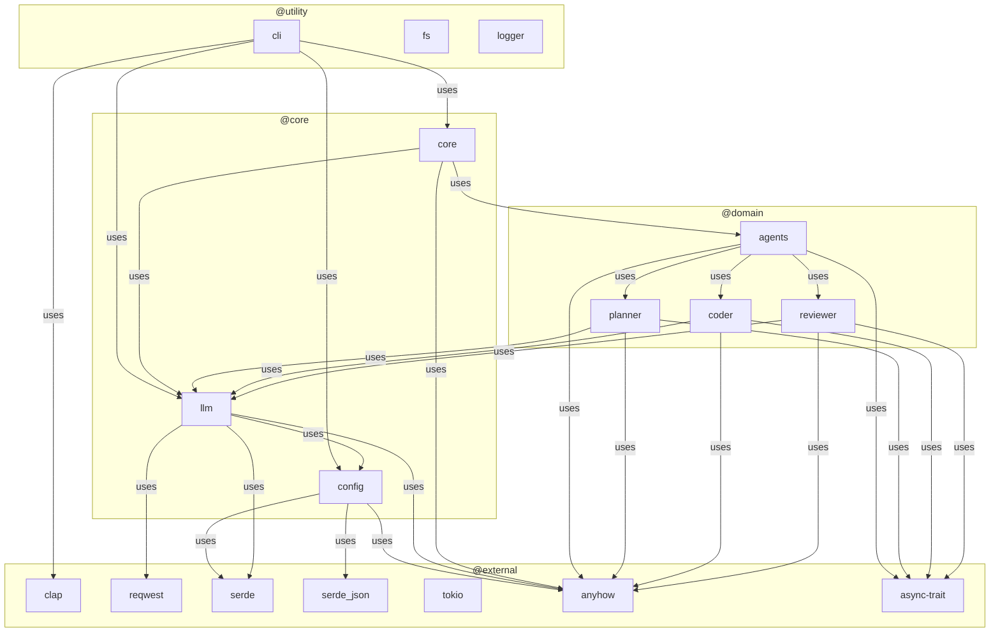
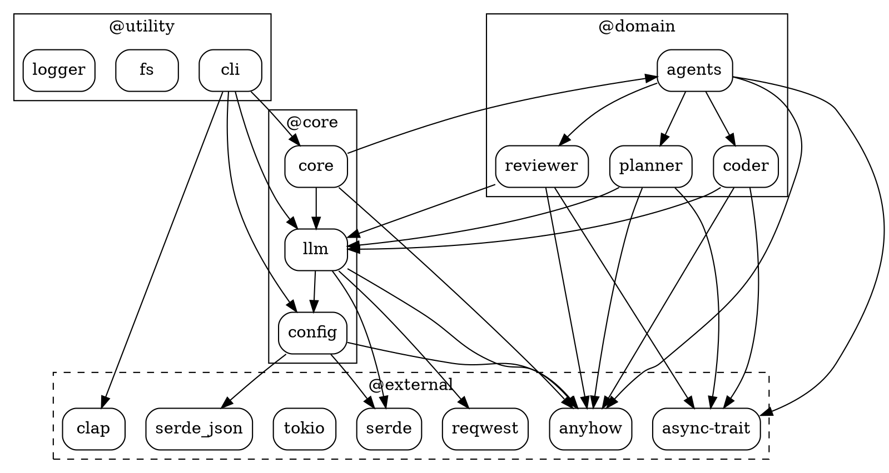

I'll analyze the PrometheOS-Lite project architecture. Let me start by exploring the codebase structure and key configuration files.

## Executive Overview

PrometheOS Lite is a Rust-based CLI tool that enables local-first multi-agent AI code generation. The system orchestrates three specialized AI agents (Planner, Coder, Reviewer) that sequentially process user tasks to generate and refine code projects. The tool is designed to work with local LLM providers (LM Studio) via OpenAI-compatible APIs, generating real project files on disk without external dependencies. Tech stack choices: Rust for performance and safety, Tokio for async runtime, Clap for CLI parsing, Reqwest for HTTP client, Serde for JSON serialization, Anyhow for error handling, and async-trait for trait-based agent abstraction. The architecture prioritizes simplicity, local execution, and extensibility for contributors.

## Module / Package Map

- **cli** (src/cli/mod.rs) - CLI entrypoint and command parsing - @utility
- **config** (src/config/mod.rs) - Runtime configuration loading with env override - @core
- **core** (src/core/mod.rs) - Sequential orchestration logic and execution context - @core
- **llm** (src/llm/mod.rs) - HTTP client for OpenAI-compatible LLM endpoints - @core
- **agents** (src/agents/mod.rs) - Agent trait definitions and implementations - @domain
- **agents/planner** (src/agents/planner.rs) - Task planning agent implementation - @domain
- **agents/coder** (src/agents/coder.rs) - Code generation agent implementation - @domain
- **agents/reviewer** (src/agents/reviewer.rs) - Code review and refinement agent - @domain
- **fs** (src/fs/mod.rs) - File parsing and writing utilities (stub) - @utility
- **logger** (src/logger/mod.rs) - Structured terminal logging (stub) - @utility

## Inter-Module Dependency Graph

## Component Deep-Dive

### agents (src/agents/mod.rs) - @domain

**Principal types & functions:**
- [Agent](cci:2://file:///e:/Projects/PrometheOS-Lite/src/agents/mod.rs:14:0-18:1) trait - async trait with [name(&self) -> &str](cci:1://file:///e:/Projects/PrometheOS-Lite/src/agents/coder.rs:49:4-51:5) and [run(&self, input: &str) -> Result<String>](cci:1://file:///e:/Projects/PrometheOS-Lite/src/cli/mod.rs:24:0-48:1)
- `AgentRole` enum - Planner, Builder, Reviewer variants with [as_str()](cci:1://file:///e:/Projects/PrometheOS-Lite/src/agents/mod.rs:28:4-34:5) method
- [PlannerAgent](cci:2://file:///e:/Projects/PrometheOS-Lite/src/agents/planner.rs:9:0-11:1) struct - wraps LlmClient
- [CoderAgent](cci:2://file:///e:/Projects/PrometheOS-Lite/src/agents/coder.rs:9:0-11:1) struct - wraps LlmClient
- [ReviewerAgent](cci:2://file:///e:/Projects/PrometheOS-Lite/src/agents/reviewer.rs:9:0-11:1) struct - wraps LlmClient

**Interaction paths:**
- Implements [Agent](cci:2://file:///e:/Projects/PrometheOS-Lite/src/agents/mod.rs:14:0-18:1) trait via `async_trait`
- Depends on [llm::LlmClient](cci:2://file:///e:/Projects/PrometheOS-Lite/src/llm/mod.rs:11:0-15:1) for LLM generation
- Each agent constructs domain-specific prompts in [prompt()](cci:1://file:///e:/Projects/PrometheOS-Lite/src/agents/coder.rs:18:4-44:5) method
- Called by [core::SequentialOrchestrator](cci:2://file:///e:/Projects/PrometheOS-Lite/src/core/mod.rs:48:0-50:1) in sequence

**Notable patterns:**
- Trait-based polymorphism for agent extensibility
- Clone pattern on LlmClient for shared HTTP client
- Structured prompt engineering with markdown templates

### agents/planner (src/agents/planner.rs) - @domain

**Principal types & functions:**
- [PlannerAgent](cci:2://file:///e:/Projects/PrometheOS-Lite/src/agents/planner.rs:9:0-11:1) struct with `llm: LlmClient`
- [new(llm: LlmClient) -> Self](cci:1://file:///e:/Projects/PrometheOS-Lite/src/llm/mod.rs:46:4-57:5) constructor
- [prompt(input: &str) -> String](cci:1://file:///e:/Projects/PrometheOS-Lite/src/agents/coder.rs:18:4-44:5) - generates structured planning prompt
- [run(&self, input: &str) -> Result<String>](cci:1://file:///e:/Projects/PrometheOS-Lite/src/cli/mod.rs:24:0-48:1) - async Agent trait implementation

**Interaction paths:**
- Calls [llm.generate(&self.prompt(input))](cci:1://file:///e:/Projects/PrometheOS-Lite/src/llm/mod.rs:98:0-101:1) for LLM inference
- Receives raw task string, outputs markdown-structured plan

**Notable patterns:**
- Prompt engineering with specific markdown sections (Task Breakdown, File Targets, Acceptance Criteria)
- Stateless design - no intermediate state between calls

### agents/coder (src/agents/coder.rs) - @domain

**Principal types & functions:**
- [CoderAgent](cci:2://file:///e:/Projects/PrometheOS-Lite/src/agents/coder.rs:9:0-11:1) struct with `llm: LlmClient`
- [new(llm: LlmClient) -> Self](cci:1://file:///e:/Projects/PrometheOS-Lite/src/llm/mod.rs:46:4-57:5) constructor
- [prompt(input: &str) -> String](cci:1://file:///e:/Projects/PrometheOS-Lite/src/agents/coder.rs:18:4-44:5) - generates code generation prompt
- [run(&self, input: &str) -> Result<String>](cci:1://file:///e:/Projects/PrometheOS-Lite/src/cli/mod.rs:24:0-48:1) - async Agent trait implementation

**Interaction paths:**
- Calls [llm.generate(&self.prompt(input))](cci:1://file:///e:/Projects/PrometheOS-Lite/src/llm/mod.rs:98:0-101:1) for LLM inference
- Receives plan string, outputs markdown-structured file contents

**Notable patterns:**
- Prompt enforces specific file format with language-specific code blocks
- Rules-based constraints in prompt (complete files, minimal output, no prose)

### agents/reviewer (src/agents/reviewer.rs) - @domain

**Principal types & functions:**
- [ReviewerAgent](cci:2://file:///e:/Projects/PrometheOS-Lite/src/agents/reviewer.rs:9:0-11:1) struct with `llm: LlmClient`
- [new(llm: LlmClient) -> Self](cci:1://file:///e:/Projects/PrometheOS-Lite/src/llm/mod.rs:46:4-57:5) constructor
- [prompt(input: &str) -> String](cci:1://file:///e:/Projects/PrometheOS-Lite/src/agents/coder.rs:18:4-44:5) - generates review prompt
- [run(&self, input: &str) -> Result<String>](cci:1://file:///e:/Projects/PrometheOS-Lite/src/cli/mod.rs:24:0-48:1) - async Agent trait implementation

**Interaction paths:**
- Calls [llm.generate(&self.prompt(input))](cci:1://file:///e:/Projects/PrometheOS-Lite/src/llm/mod.rs:98:0-101:1) for LLM inference
- Receives coder output, outputs review with refined files if needed

**Notable patterns:**
- Conditional refinement logic embedded in prompt
- Confidence scoring mechanism (High/Medium/Low)
- Preservation of builder's intended structure unless wrong

### config (src/config/mod.rs) - @core

**Principal types & functions:**
- [AppConfig](cci:2://file:///e:/Projects/PrometheOS-Lite/src/config/mod.rs:10:0-14:1) struct with `provider: String`, `base_url: String`, `model: String`
- [load() -> Result<Self>](cci:1://file:///e:/Projects/PrometheOS-Lite/src/config/mod.rs:17:4-19:5) - loads from default path
- [load_from(path: impl AsRef<Path>) -> Result<Self>](cci:1://file:///e:/Projects/PrometheOS-Lite/src/config/mod.rs:21:4-37:5) - loads from custom path
- Environment variable override for `PROMETHEOS_BASE_URL` and `PROMETHEOS_MODEL`

**Interaction paths:**
- Deserializes JSON config file via `serde_json`
- Overrides config values from environment variables
- Used by [cli](cci:9://file:///e:/Projects/PrometheOS-Lite/src/cli:0:0-0:0) and [llm](cci:9://file:///e:/Projects/PrometheOS-Lite/src/llm:0:0-0:0) modules

**Notable patterns:**
- Builder pattern not used; direct struct construction
- Environment override provides deployment flexibility
- Context-rich error handling via `anyhow::Context`

### core (src/core/mod.rs) - @core

**Principal types & functions:**
- [ExecutionContext](cci:2://file:///e:/Projects/PrometheOS-Lite/src/core/mod.rs:10:0-15:1) struct - holds task, plan, generated_output, review
- [ExecutionResult](cci:2://file:///e:/Projects/PrometheOS-Lite/src/core/mod.rs:29:0-31:1) struct - wraps ExecutionContext with accessor methods
- [SequentialOrchestrator](cci:2://file:///e:/Projects/PrometheOS-Lite/src/core/mod.rs:48:0-50:1) struct - orchestrates agent pipeline
- [SequentialOrchestrator::new(llm: LlmClient) -> Self](cci:1://file:///e:/Projects/PrometheOS-Lite/src/llm/mod.rs:46:4-57:5)
- [SequentialOrchestrator::run(&self, task: impl Into<String>) -> Result<<ExecutionResult>](cci:1://file:///e:/Projects/PrometheOS-Lite/src/cli/mod.rs:24:0-48:1)

**Interaction paths:**
- Instantiates PlannerAgent, CoderAgent, ReviewerAgent with shared LlmClient
- Chains agent outputs: task → plan → code → review
- Accumulates results in ExecutionContext

**Notable patterns:**
- Sequential orchestration pattern (no parallelism)
- Immutable context passing between agents
- Clone-based LlmClient sharing for thread safety

### llm (src/llm/mod.rs) - @core

**Principal types & functions:**
- [LlmClient](cci:2://file:///e:/Projects/PrometheOS-Lite/src/llm/mod.rs:11:0-15:1) struct with `http: Client`, `base_url: String`, `model: String`
- [new(base_url: impl Into<String>, model: impl Into<String>) -> Result<Self>](cci:1://file:///e:/Projects/PrometheOS-Lite/src/llm/mod.rs:46:4-57:5)
- [from_config(config: &AppConfig) -> Result<Self>](cci:1://file:///e:/Projects/PrometheOS-Lite/src/llm/mod.rs:59:4-65:5) - factory from config
- [generate(&self, prompt: &str) -> Result<String>](cci:1://file:///e:/Projects/PrometheOS-Lite/src/llm/mod.rs:98:0-101:1) - async LLM inference
- [generate(prompt: &str) -> Result<String>](cci:1://file:///e:/Projects/PrometheOS-Lite/src/llm/mod.rs:98:0-101:1) - standalone async function
- Internal types: [ChatCompletionRequest](cci:2://file:///e:/Projects/PrometheOS-Lite/src/llm/mod.rs:18:0-22:1), [ChatMessage](cci:2://file:///e:/Projects/PrometheOS-Lite/src/llm/mod.rs:25:0-28:1), [ChatCompletionResponse](cci:2://file:///e:/Projects/PrometheOS-Lite/src/llm/mod.rs:31:0-33:1), [ChatChoice](cci:2://file:///e:/Projects/PrometheOS-Lite/src/llm/mod.rs:36:0-38:1), [AssistantMessage](cci:2://file:///e:/Projects/PrometheOS-Lite/src/llm/mod.rs:41:0-43:1)

**Interaction paths:**
- Makes HTTP POST to `{base_url}/v1/chat/completions`
- Serializes request via `serde`
- Deserializes response via `serde`
- 120-second timeout on HTTP client

**Notable patterns:**
- OpenAI-compatible API abstraction
- Provider validation (only "lmstudio" supported currently)
- Single-message requests (no conversation history)
- Non-streaming responses (stream: false)

## Utility & Core Mapping Cheat-Sheet

| Component | Tag | Description |
|-----------|-----|-------------|
| AppConfig | @core | JSON configuration loader with environment override support |
| LlmClient | @core | HTTP client for OpenAI-compatible LLM API endpoints |
| SequentialOrchestrator | @core | Sequential agent pipeline orchestrator |
| ExecutionContext | @core | Immutable context container for agent chain |
| Agent trait | @domain | Async trait defining agent interface |
| PlannerAgent | @domain | Task planning agent with structured markdown output |
| CoderAgent | @domain | Code generation agent with file block output |
| ReviewerAgent | @domain | Code review and refinement agent |
| Cli | @utility | Clap-based CLI entrypoint and command parser |
| clap | @external | Command-line argument parsing library |
| reqwest | @external | Async HTTP client with TLS support |
| serde/serde_json | @external | Serialization/deserialization framework |
| tokio | @external | Async runtime with multi-threaded scheduler |
| anyhow | @external | Error handling with context |
| async-trait | @external | Async trait support macro |
| fs module | @utility | File parsing and writing (currently stub) |
| logger module | @utility | Structured terminal logging (currently stub) |

## Key Data Flows & Lifecycles

**Canonical Request Flow:**

1. **User Input**: User executes `cargo run -- run "build a simple SaaS landing page"`
2. **CLI Parsing**: [cli::run()](cci:1://file:///e:/Projects/PrometheOS-Lite/src/cli/mod.rs:24:0-48:1) parses command via Clap, extracts task string
3. **Config Loading**: [AppConfig::load()](cci:1://file:///e:/Projects/PrometheOS-Lite/src/config/mod.rs:17:4-19:5) reads [prometheos.config.json](cci:7://file:///e:/Projects/PrometheOS-Lite/prometheos.config.json:0:0-0:0), applies env overrides
4. **LLM Client Creation**: [LlmClient::from_config(&config)](cci:1://file:///e:/Projects/PrometheOS-Lite/src/llm/mod.rs:59:4-65:5) validates provider (lmstudio), builds HTTP client with 120s timeout
5. **Orchestrator Initialization**: [SequentialOrchestrator::new(llm)](cci:1://file:///e:/Projects/PrometheOS-Lite/src/llm/mod.rs:46:4-57:5) creates orchestrator with shared LlmClient
6. **Sequential Execution** (async):
   - **Planner Phase**: [PlannerAgent::new(llm.clone()).run(&task)](cci:1://file:///e:/Projects/PrometheOS-Lite/src/llm/mod.rs:46:4-57:5) calls [llm.generate()](cci:1://file:///e:/Projects/PrometheOS-Lite/src/llm/mod.rs:98:0-101:1) with planning prompt, returns markdown plan
   - **Coder Phase**: [CoderAgent::new(llm.clone()).run(&plan)](cci:1://file:///e:/Projects/PrometheOS-Lite/src/llm/mod.rs:46:4-57:5) calls [llm.generate()](cci:1://file:///e:/Projects/PrometheOS-Lite/src/llm/mod.rs:98:0-101:1) with coding prompt, returns file blocks
   - **Reviewer Phase**: [ReviewerAgent::new(llm.clone()).run(&output)](cci:1://file:///e:/Projects/PrometheOS-Lite/src/llm/mod.rs:46:4-57:5) calls [llm.generate()](cci:1://file:///e:/Projects/PrometheOS-Lite/src/llm/mod.rs:98:0-101:1) with review prompt, returns review/refinements
7. **Result Accumulation**: ExecutionContext accumulates plan, generated_output, review
8. **Output**: CLI prints each phase result to terminal

**Async/Sync Boundaries:**
- Entry point: [main.rs](cci:7://file:///e:/Projects/PrometheOS-Lite/src/main.rs:0:0-0:0) uses `#[tokio::main]` for async runtime
- All LLM calls are async via `reqwest`
- Agent [run()](cci:1://file:///e:/Projects/PrometheOS-Lite/src/cli/mod.rs:24:0-48:1) methods are async via `async-trait`
- Config loading is synchronous (file I/O)
- CLI parsing is synchronous

**Caching**: No caching implemented; each LLM call is independent

**Persistence**: 
- Config loaded from disk at startup
- Generated files intended for disk output (fs module stub, not implemented)
- No state persistence between runs

## Extensibility / Refactor Hotspots

**Natural Extension Points:**
1. **Agent Plugin System**: Add dynamic agent registration via trait objects or config-driven instantiation
2. **LLM Provider Abstraction**: Extract provider-specific logic into strategy pattern (currently hard-coded to "lmstudio")
3. **File System Module**: Implement stubbed [fs](cci:9://file:///e:/Projects/PrometheOS-Lite/src/fs:0:0-0:0) module for actual file writing capabilities
4. **Logging Module**: Implement stubbed [logger](cci:9://file:///e:/Projects/PrometheOS-Lite/src/logger:0:0-0:0) module for structured logging
5. **Conversation History**: Extend LlmClient to support multi-turn conversations with context

**Tight Couplings/Bottlenecks:**
1. **Hard-coded Provider Check**: [LlmClient::from_config()](cci:1://file:///e:/Projects/PrometheOS-Lite/src/llm/mod.rs:59:4-65:5) hard-coded to reject non-lmstudio providers
2. **Sequential Orchestration**: No parallel execution capability; agents run sequentially even when independent
3. **Prompt Engineering in Code**: Prompts embedded as string literals in agent implementations, difficult to tune without recompilation
4. **No Error Recovery**: Single LLM failure aborts entire pipeline; no retry logic or fallback
5. **Clone-Heavy Pattern**: LlmClient cloned for each agent; could use Arc for shared ownership

**Refactor Suggestions:**
1. Extract prompt templates to external YAML/JSON files for runtime editing
2. Implement retry logic with exponential backoff in LlmClient
3. Add provider trait interface (OpenAI, Anthropic, local) with factory pattern
4. Implement fs module with file writing from reviewer's refined output
5. Add logger module with configurable verbosity and structured output
6. Consider parallel agent execution for independent subtasks (future enhancement)